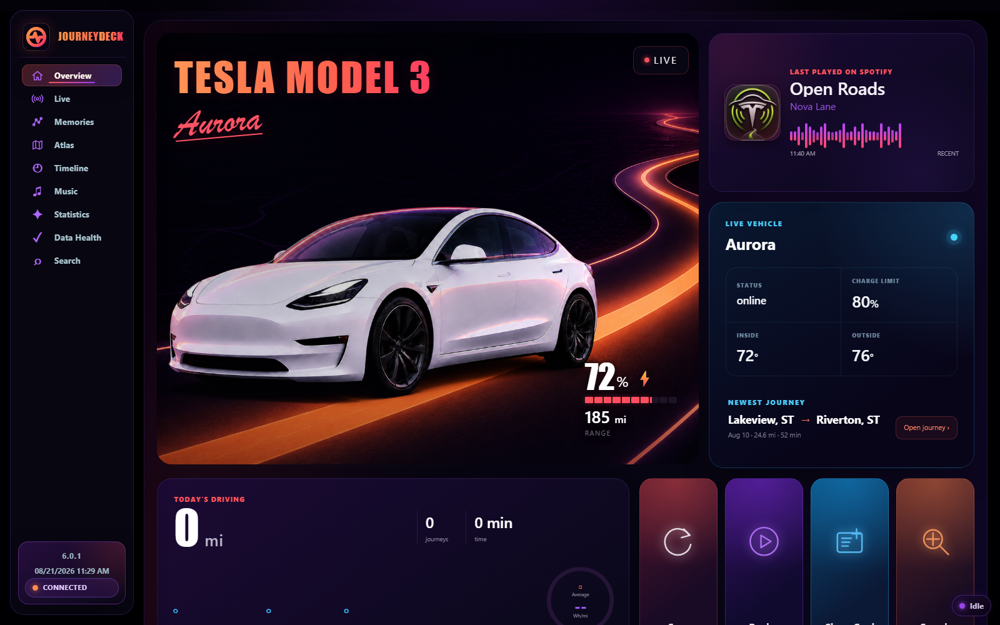
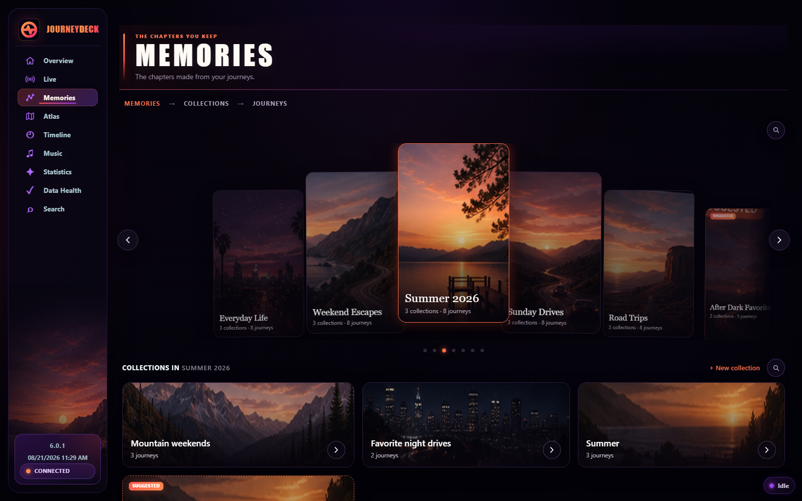
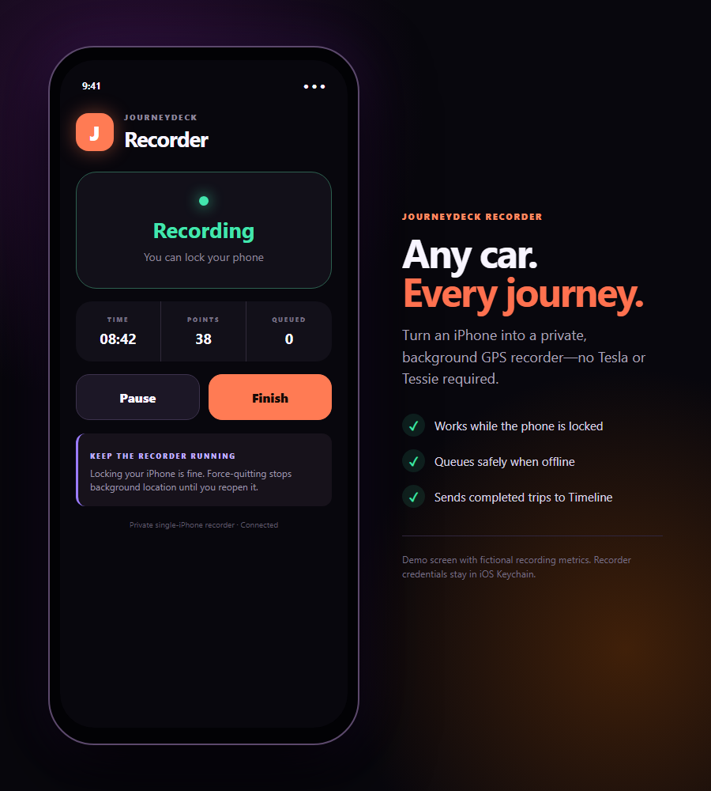

<div align="center">
  

  <h3>Your journeys, places, and music—beautifully remembered.</h3>

  <p>
    A private driving journal for Tesla data, any-car iPhone recording, Spotify history, maps, memories, and personal insights.
  </p>

  <p><sub>Version 6.0.1 · Personal project · Web, iPhone Recorder, and Windows desktop</sub></p>
</div>



> Every vehicle, location, journey, metric, artist, and recording shown here is fictional demo data. No personal location history is included.

## What is JourneyDeck?

JourneyDeck turns everyday travel into a private, searchable story. It brings together where you went, how you got there, what you listened to, and the patterns that emerge over time.

Journeys can arrive automatically from a Tesla through Tessie or be recorded directly by the **JourneyDeck Recorder** on an iPhone. Both sources feed the same Timeline, Atlas, Memories, music views, and statistics.

JourneyDeck is currently a personal, single-household project—not a public hosted service.

## Highlights

- **Overview and Live** — current vehicle state, latest journey, battery, range, recent music, and quick actions.
- **Timeline** — journeys, charging, songs, and stops arranged in chronological order.
- **Memories** — collect journeys into visual chapters such as road trips, weekends, seasons, and favorites.
- **Atlas** — explore places, routes, recurring patterns, and changes in your personal mobility graph.
- **Journey Music** — connect Spotify listening history to the miles where each song played.
- **Statistics** — mileage, energy, efficiency, drive time, music, Autopilot, and period comparisons.
- **Privacy-aware sharing** — generate journey cards without exposing a home address or exact private coordinates.
- **Responsive access** — use the hosted dashboard on desktop or mobile, or package the Windows desktop experience.

## Record with Tesla—or just an iPhone

| | Tesla + Tessie | JourneyDeck Recorder |
| --- | --- | --- |
| **Works with** | A Tesla connected to Tessie | Any car, rental, walk, or road trip |
| **Capture** | Automatic telemetry import | Start and finish from the iPhone app |
| **Data** | Route, vehicle, battery, charging, efficiency, and drive metrics | GPS route, time, distance, and speed metrics |
| **Background use** | Cloud synchronization | Continues while the iPhone is locked |
| **Offline behavior** | Depends on the vehicle provider | Queues points safely and retries automatically |

The two approaches can coexist. Recorder journeys are labeled clearly and appear alongside provider-imported journeys.

## Memories made from the road



Build collections, combine them into larger Memories, attach photos, and revisit the routes and music that made a season or trip memorable.

## JourneyDeck Recorder for iPhone



The Recorder is a small Expo iOS companion that captures background GPS without requiring a Tesla. It stores the private server key in iOS Keychain, keeps an offline SQLite queue, retries uploads safely, and creates a normal JourneyDeck journey when recording finishes.

Locking the phone is fine; force-quitting the Recorder stops iOS background location until the app is reopened.

## Try the demo UI

The repository includes a privacy-safe mock server with fictional journeys and music. With Node.js 24 or newer:

```powershell
git clone https://github.com/drumpat01/DriveOS.git
cd DriveOS
npm install
node tests/mock-web-server.mjs
```

Open [http://127.0.0.1:8790](http://127.0.0.1:8790) to explore the interface without connecting any accounts.

## Run your own JourneyDeck

JourneyDeck is designed for a technically comfortable owner who wants to operate a private archive. A full setup needs:

1. A JourneyDeck server and SQLite or Turso database.
2. At least one journey source: Tessie for Tesla or the iOS Recorder for any vehicle.
3. Optional Spotify OAuth for listening history and journey soundtracks.
4. Optional place enrichment for friendlier destination names.

Choose the guide that matches your setup:

- [Windows desktop installation](INSTALLATION.txt)
- [Hosted Node, Atlas, and Turso architecture](docs/atlas-node-hybrid.md)
- [JourneyDeck Recorder setup and builds](mobile/recorder/README.md)
- [Security model](SECURITY.md)

## Development

Install dependencies and run the full validation suite:

```powershell
npm install
.\tools\Test-DriveOS.ps1
```

README screenshots can be regenerated entirely from fictional fixtures:

```powershell
node tools/capture-readme-screenshots.mjs
```

Architecture and migration notes live in [docs/ARCHITECTURE.md](docs/ARCHITECTURE.md) and [docs/MIGRATION-ROADMAP.md](docs/MIGRATION-ROADMAP.md).

## Privacy and project status

- JourneyDeck contains sensitive location history and should remain behind strong authentication.
- Hosted secrets stay in the deployment environment; Recorder credentials stay in iOS Keychain.
- Local runtime data, credentials, logs, and generated databases are excluded from Git.
- The project is a personal beta and still assumes a trusted owner or household rather than public multi-user onboarding.

JourneyDeck is not affiliated with or endorsed by Tesla, Tessie, Spotify, Apple, Expo, Foursquare, OpenFreeMap, or OpenStreetMap. Product names and trademarks belong to their respective owners.
