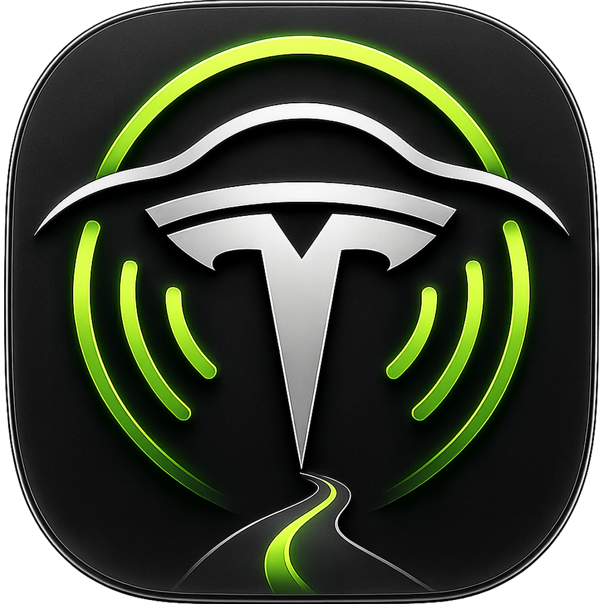
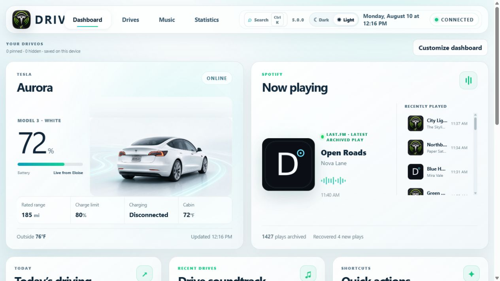
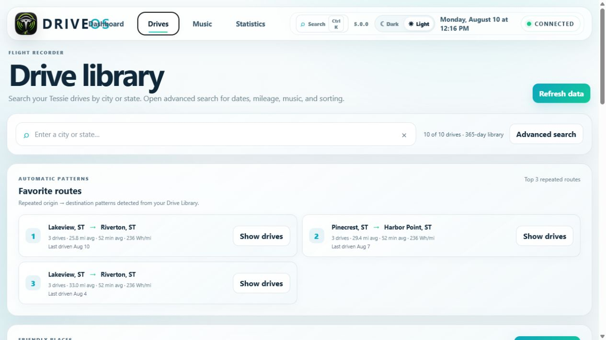
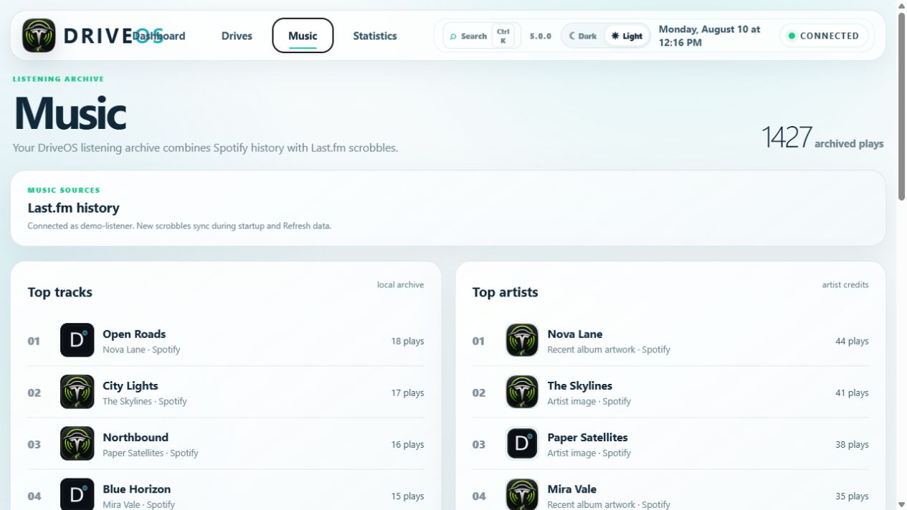

<div align="center">
  

# DriveOS

### Personal vehicle intelligence for your drives, music, charging, and travel history

DriveOS is a local-first Windows desktop application that turns Tesla telemetry and listening history into a customizable dashboard, searchable drive library, music archive, statistics, recaps, and privacy-aware share cards.

**Windows desktop | Tesla + Tessie | Spotify | Last.fm | Local data**
</div>



> **Privacy note:** Every location, trip, vehicle name, song, and artist shown in these screenshots is fictional demo data. No personal drive history or home location is included.

## What DriveOS does

DriveOS brings vehicle data and the soundtrack of each trip together in one interface. It records a local drive history from Tessie, connects songs to the drives in which they played, finds recurring routes and places, and turns the result into useful dashboards and visual summaries.

The application runs on your own Windows computer. Its web interface is served only to the desktop app through localhost, while long-lived credentials are encrypted for the current Windows account.

## Highlights

- **Customizable dashboard** - rearrange widgets with drag and drop; resize them to Compact, Standard, or Wide; hide panels; and pin favorites.
- **Vehicle overview** - see battery, rated range, charge limit, charging state, temperatures, status, and current-location context.
- **Drive library** - search trips by place, date, distance, and music; inspect a drive; replay its route; and see numbered song-start markers on the map.
- **Music intelligence** - combine Spotify history with Last.fm scrobbles, browse recent plays, restore album artwork, and review top tracks and artists.
- **Drive soundtrack** - discover the top song, artist, album, and listening mood from recent drives.
- **Statistics and recaps** - explore mileage, efficiency, drive time, trip totals, listening activity, charging, and monthly summaries.
- **Privacy-aware share cards** - customize themes, map styles, statistics, and artwork, preview privacy protections, and save a PNG locally.
- **Command palette** - press `Ctrl+K` to search drives, places, songs, settings, and actions from one box.

## Screenshots

### Searchable drive history and favorite routes



### A combined Spotify and Last.fm listening archive



## More notable features

- Today's driving summary with miles, drive time, efficiency, trips, and songs
- Recent-drive cards and detailed trip views
- Current vehicle location map in the wide vehicle widget
- Route replay with synchronized song moments
- Favorite-route and frequently visited-place detection
- Top-track and top-artist artwork enrichment through Spotify
- Scrollable recent-play history on larger dashboard widgets
- Quick actions for refreshing, searching, opening the latest drive, creating a share card, and starting a recap
- Light and dark themes with responsive layouts
- Download handling that lets the Windows desktop app save generated PNG share cards locally
- Local caching and incremental synchronization to reduce unnecessary service requests

## Service integrations

| Service | What DriveOS uses it for | Setup level |
| --- | --- | --- |
| **Tessie** | Tesla vehicle status, telemetry, drive history, routes, charging data, and location | Needed for vehicle and drive features |
| **Spotify Web API** | Recent listening history, currently playing data, album artwork, artist images, and private playlist access | Needed for Spotify music features |
| **Last.fm API** | A deeper, durable scrobble history that can extend beyond Spotify's recent-history window | Optional, recommended for a richer archive |
| **Foursquare Places API** | Friendly names for repeated or otherwise unnamed locations | Optional |
| **OpenFreeMap / OpenStreetMap** | Map tiles and geographic context for routes and places | Built in; no map API key required |

DriveOS uses Spotify's Authorization Code flow with PKCE, so a Spotify client secret is not stored in the application. Last.fm and Foursquare credentials are optional and are stored locally with Windows DPAPI protection.

## What you need

- A 64-bit Windows 10 or Windows 11 computer
- Windows PowerShell 5.1 or newer
- Microsoft Edge WebView2 Runtime
- Internet access during installation and synchronization
- A Tessie account and API token for Tesla features
- A Spotify Developer application and Client ID for music features
- Optional Last.fm username/API key and Foursquare Service API key

The installer downloads the pinned Microsoft WebView2 SDK, verifies the native Microsoft signature, builds the desktop application, and creates a desktop shortcut. Administrator rights are not normally required when the project folder and desktop are writable by your Windows account.

## Quick start

Clone the repository or download and extract its ZIP file:

```powershell
git clone https://github.com/drumpat01/DriveOS.git
cd DriveOS
```

Provide your Tessie token and Spotify Client ID, then store them securely for the current Windows user:

```powershell
$env:TESSIE_TOKEN = "your-tessie-token"
$env:SPOTIFY_CLIENT_ID = "your-spotify-client-id"
.\Setup-DriveOS-Secrets.ps1
```

Install the desktop application:

```powershell
.\Install-DriveOS-App.ps1
```

Open **DriveOS** from the new desktop shortcut, authorize Spotify when prompted, and use **Refresh data** to build the first local archive.

For credential setup, optional integrations, updates, troubleshooting, and uninstall steps, see [INSTALLATION.txt](INSTALLATION.txt).

## Safe deployment workflow

Start from `main` with the intended source changes present, then run:

```powershell
.\Deploy-DriveOS.ps1 -CommitMessage "Describe the release"
```

The workflow runs release checks, updates `main` with a fast-forward-only pull,
creates a timestamped `deploy/*` branch, rejects secrets and generated binaries,
shows the exact staged files, asks for confirmation, pushes only that branch,
and prints the GitHub pull-request URL. Render deploys after the PR is merged
into `main`.

Run checks without creating a branch or commit with:

```powershell
.\Deploy-DriveOS.ps1 -PreflightOnly
```

## Automatic Spotify history sync

Hosted DriveOS exposes a single-purpose `POST /api/spotify/sync` endpoint for
the scheduled GitHub Actions workflow. The endpoint is disabled on desktop and
accepts only requests carrying the private sync token.

Configure one random secret of at least 32 characters in both places:

- Render: `DRIVEOS_SPOTIFY_SYNC_SECRET`
- GitHub Actions repository secret: `DRIVEOS_SYNC_TOKEN`

Also configure the GitHub Actions repository secret `DRIVEOS_SYNC_URL` with the
hosted DriveOS origin, such as `https://driveos.example.com` (no trailing path).
The workflow runs every two hours and can be started manually from GitHub's
Actions page. Each run asks Spotify for the latest 50 plays and archives only
new records through DriveOS's existing Turso deduplication path.

## Local-first privacy and security

- The desktop service binds to `127.0.0.1`, not the public network.
- A per-session credential protects local API requests.
- Tessie, Spotify, Last.fm, and Foursquare credentials are encrypted with Windows DPAPI and tied to the Windows user who configured them.
- Runtime data is kept in the local `data` directory and excluded from Git.
- Share-card privacy controls can replace exact places with city-level labels and exclude home coordinates and street addresses.
- WebView2 navigation, permissions, downloads, certificates, and allowed remote hosts are restricted by the desktop security policy.

See [SECURITY.md](SECURITY.md) for the security model and reporting guidance.

## Development and testing

DriveOS 5.0 is built with a PowerShell backend, a modular HTML/CSS/JavaScript interface, and a C# WebView2 desktop host. No Node package installation is required for normal use.

Run the project's automated checks from PowerShell:

```powershell
.\tools\Test-DriveOS.ps1
```

Architecture and migration details are available in [docs/ARCHITECTURE.md](docs/ARCHITECTURE.md) and [docs/MIGRATION-ROADMAP.md](docs/MIGRATION-ROADMAP.md).

## Platform and project status

DriveOS 5.0 currently targets 64-bit Windows and is designed as a personal, locally operated application. Other platforms are not currently packaged or supported.

DriveOS is not affiliated with or endorsed by Tesla, Tessie, Spotify, Last.fm, Foursquare, OpenFreeMap, or OpenStreetMap. Product names and trademarks belong to their respective owners.
